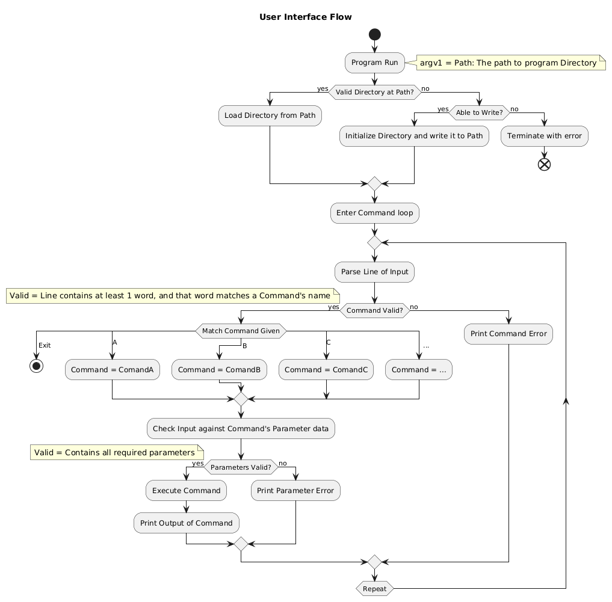
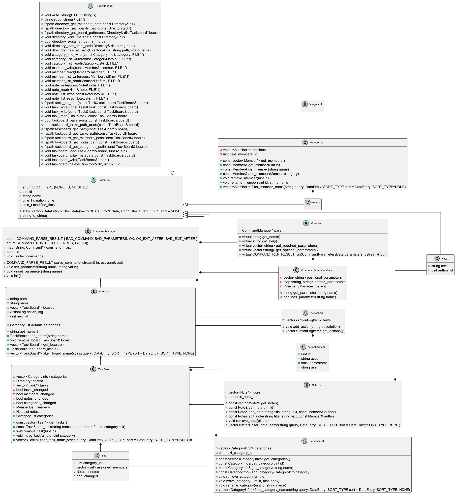

 # Categorized Task Board (CaTaBoard) (Name Tenative)
 Simple C++ CLI program for creating and managing Kanban-like task boards.
 > Authors: 
 [Isaias Bernal](https://github.com/IsaiasB1122)
 [Dang Nguyen](https://github.com/Nhin0928)
 [Cristian Roberts](https://github.com/crisapi)
 [Reuben Self](https://github.com/rselfucr)

 ## Project Description
 > CaTaBoard will be a console application where a user is able to maintain a local Directory of Task Boards, via a command REPL loop.
 > ### Primary Features
 > * Ability to customize the available Categories for Tasks (e.g. TODO, In Progress, Completed, Needs Review..)
 > * Creation of multiple Task Boards.
 > * Track members assigned to a Task or Task Board, and view statistics related to their contributions.
 > * Ability to assosciate extra information related to a Task or Task Board via a list of Notes, which can be appended to over time to not only describe tasks but also track issues and events during development.
 > * Ability to sort existing Tasks within a Task Board by recent activity, creation ID, and filter by Category or assigned Member.
 > * Full timestamped Log of all changing actions made in the Directory.
 > * Display a Task Board in a pretty table-like view with each Category having a column.
 > ### Potential Extra Features
 > * Users: Have a user set for each "session" (changeable via command) that is also logged for each action.
 > * Text Graphics Extras: Associate a color with each Category that will color the name of tasks in all output, generate charts like burndown charts, workload split charts, etc.
 > * Undo: Allow all actions recorded in the Log to be undone.
 > * Syncing: Configure a Directory to try to sync with a server of some sort.
 > ### Implementation Details
 > * C++ CLI application.
  > * Targeting unix (hard target: running on UCR CS SSH machines)
    (Ideally should be able to compile and run on windows, but certain terminal features which we may use are not completely platform independent.)
 > * No third party libraries outside of C++ stdlib are expected to be necessary.
 > * Persistent data structures such as the task Directory itself, Task Boards, etc, will be mapped to specific classes, and all functionality of those structures will be implemented as class methods. The Directory will be given as an argument when running and either be created or loaded. Writes will be made immediately after a changing command is ran, to avoid data loss due to crashing.
 > * The console interface will be entirely modular, meaning that no actual program functionality is implemented by code that handles parsing commands or returning command output. This will make the program more extensible, supporting hypothetical potential features like a GUI or web API.
 > ### Input / Output
 > The software receives inputs from commands in an interactive loop.
 > Commands output results as simple text split by line. More advanced text graphics will be avoided. (Colored text may be used, and the output of some commands may be calculated based on the current terminal width.)

## Project Interest
> We believe this project will be interesting for several reasons.
> 1. The topic will relate to what we are learning in this semester of CS100, and give us a chance to directly apply and reinforce that knowledge.
> 2. The program itself will have a practical application, while also being simple to implement and use.
> 3. The project will be an approachable opportunity to gain experience in concepts that are key to software development. (designing file formats, working with a system of classes, creating a system to parse and run commands, sorting, filtering, and managing database-like structures)


## User Interface Specification

### Navigation Diagram
> As our project is a terminal application where each command takes input and gives output non-interactively, a screen navigation diagram is not applicable. 
To clarify the operation of our program, see the interface logic diagram here:



### Screen Layouts
> As our project shows output via printed text and not a drawn screen, a screen layout diagram is not applicable.
For clarity, see an example session of our program (user input lines marked by >>)
See docs\commands.txt for additional command specifications
```
# exact output format subject to change
cataboard /Cataboard # run program
>> list-boards
[0 Lab1 Taskboard]
[1 Lab2 Taskboard]
[2 Todolist]
[3 Final]
>> set --board Todolist
board = Todolit
>> list-tasks --category TODO
[2  TODO  Check Registration]
[12 TODO  Clean room]
[13 TODO  HW04]
>> show-task 13
Task #13 HW04
Category: TODO
Notes:
[0  Assignment Link] ------------------------------------
"https://elearn.ucr.edu/courses/147069/assignments/757552"
---------------------------------------------------------
>> categorize-task 13 Finished
CATEGORIZE TASK [13 Finished  HW04] TODO-->Finished
>> summary Board1 --start TODO --end "In Progress"
|------------------------------------------------------------------------|
||          TODO                  ||          In Progress               || 
|---------------------------------||------------------------------------||
|| 2 Check Registration           || 10 Review for econ midterm         ||
|| 12 Clean Room                  || 1 Write resume                     ||
||                                || 14 Lab3                            ||
||                                || 0  Clean old tasklist              ||
||                                ||                                    ||
|------------------------------------------------------------------------|
>> add-task --board "Lab2 Taskboard" "Start lab" --category TODO
ADD TASK [0 TODO  Start Lab]
>> exit
```

## Class Diagram
> This is a UML diagram of our class hierarchy and relationships.
Some notes:
CommandManager is listed as a class for the purpose of showing its relationships but is actually just a namespace.
Command is the base class which the Command classes that implement the functionality of each command will inherit.
The Directory class is the "root" object of the data and only one such object exists in the program session.
All others can have multiple instances.
The base class DataEntry is used so that a common filter and sort function can be used for its derived classes. Note that some of its derived classes do not have any additional members; this is intentional and is done to better reflect the intent of those data types, rather than using the base class itself.


 
### Class Specification Changes
Some changes were made from the initial class specification as we began to work on the project.<br>
A major change was splitting the program's file IO handling functionality into the FileIOManager class. Previously, we had each class designed to take care of its own writing and reading. This was in violation of the Single Responsibility principle, as classes mean to manage abstract TaskBoard data were being asked to handle the complex responsibility of reading and writing that data to and from the disk. It also violated the Open-closed principle, as baking the file system IO directly into the fundamental data classes made the program less open to being extended in the event that we wanted to change to a different method of storing data.<br>
There were also some minor changes made to the existing interfaces. For example, the ability to access command paramters by index was removed, in favor of only having the ability to access them by name. This simplified the interface by removing a redundant method, and also made the code more clear to read as now the parameter named was being used and not simply an integer literal.<br>
Several redundant and unneeded methods were also trimmed for he purpose of keeping the interfaces clean.<br>
There were no other major changes made to the class specifications.

 
 > ## Final deliverable
 > All group members will give a demo to the reader during lab time. ou should schedule your demo on Calendly with the same reader who took your second scrum meeting. The reader will check the demo and the project GitHub repository and ask a few questions to all the team members. 
 > Before the demo, you should do the following:
 > * Complete the sections below (i.e. Screenshots, Installation/Usage, Testing)
 > * Plan one more sprint (that you will not necessarily complete before the end of the quarter). Your In-progress and In-testing columns should be empty (you are not doing more work currently) but your TODO column should have a full sprint plan in it as you have done before. This should include any known bugs (there should be some) or new features you would like to add. These should appear as issues/cards on your Project board.
 > * Make sure your README file and Project board are up-to-date reflecting the current status of your project (e.g. any changes that you have made during the project such as changes to your class diagram). Previous versions should still be visible through your commit history.
>  * Each team member should also submit the Individual Contributions Form on Canvas for this final phase. In this form, you need to fill in the names of all team members, the percentage of work contributed by each member for the final phase, and a description of their contributions. Remember that each team member should submit the form individually.
 
 ## Screenshots
 > Screenshots of the input/output after running your application
 ## Installation/Usage
 > Instructions on installing and running your application
 ## Testing
 > How was your project tested/validated? If you used CI, you should have a "build passing" badge in this README.
 
